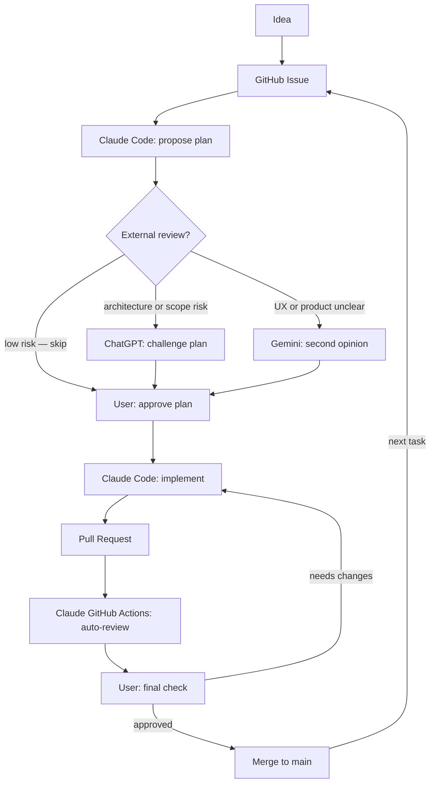

# AI Development Workflow — Blueprint

This directory documents a reusable AI-assisted development workflow for building software projects faster and more safely.

It is designed to be adopted as a starting template for new repos — not just read as documentation.

---

## What this is

A repeatable setup where multiple AI tools support different parts of the development process, from planning through implementation and review.

The workflow has been tested on the `AI-Lyric-Generator` repository and refined here.

---

## Core idea

Claude builds.

ChatGPT reviews architecture and product direction.

Gemini gives a second opinion on UX and usefulness.

The user makes the final decision.

---

## Workflow loop

---

## Workflow stages

1. Capture the project idea
2. Turn the idea into a GitHub Issue
3. Ask Claude Code for an implementation plan
4. Ask ChatGPT to review the plan (when the change is consequential)
5. Ask Gemini for a second opinion (when product or UX clarity matters)
6. Let Claude Code implement one focused change
7. Open a Pull Request
8. Let Claude GitHub Actions review the PR automatically
9. Merge only after human approval

---

## How to adopt this workflow for a new repo

The `templates/` folder contains ready-to-use files. To apply this workflow to a new project:

1. Copy `templates/CLAUDE.md` into the repo root as `CLAUDE.md` and fill in the placeholders.
2. Create a `.ai/` folder in the repo root.
3. Copy these files into `.ai/`:
   - `project-brief.md`
   - `agent-workflow.md`
   - `coding-rules.md`
   - `task-template.md`
4. Optionally copy `issue-template.md` and `pr-template.md` into `.github/`.
5. Fill in all `[PLACEHOLDER]` values.
6. Install the Claude GitHub App by running `/install-github-app` inside Claude Code.

See `setup-checklist.md` for the full step-by-step setup process.

---

## Files in this workflow

- `roles.md` — defines the role of each AI tool and the user
- `workflow.md` — explains the full development workflow
- `issue-to-pr-flow.md` — documents the GitHub Issue → Branch → PR process with example prompts
- `external-reviewers.md` — explains how and when to use ChatGPT and Gemini as reviewers
- `setup-checklist.md` — step-by-step checklist for applying this workflow to a new repo
- `templates/` — ready-to-copy starter files for CLAUDE.md, .ai/, GitHub Issues, and PRs

---

## Current status

Documented and actively used as the workflow for builtbytoobai projects.
